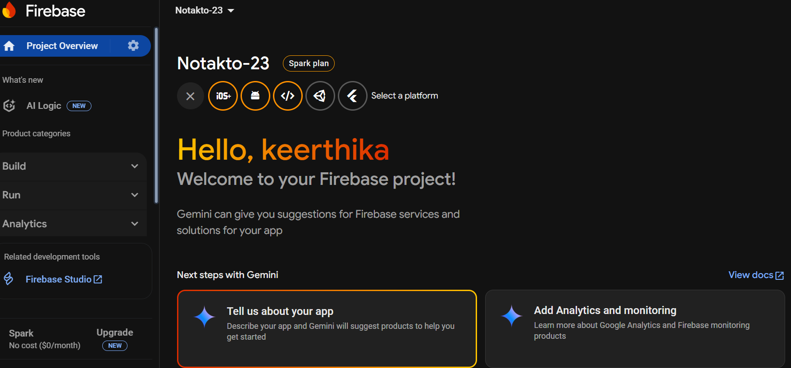

# 🔧 Firebase Setup Guide for Notakto
<!-- 
  This markdown file is meant to be inside docs/firebase-setup.md.
  Contributors can follow this step-by-step guide to set up Firebase Authentication and Firestore locally.
  Screenshots can be added using markdown image syntax: 
-->

This guide helps you configure **Firebase** for local development so that features like Authentication, Firestore work properly.

## 1️⃣ Create a Firebase Project

1.Go to Firebase Console.
2.Click Add Project → Enter a project name, e.g., Notakto-dev.
3.Select Standard Edition.
4.Disable Google Analytics (optional) → Click Create Project.
5.Wait for project setup to complete.
 

💡Tip: Choose a meaningful project name so you can easily identify it in their console

## 2️⃣ Add a Web App

1. Click the Web (</>) icon in your project overview.
2. Enter a nickname (e.g., Notakto-Web).
3. Click Register App.
4. Copy the Firebase config object 

  
// Example Firebase config snippet
const firebaseConfig = {
  apiKey: "YOUR_API_KEY",
  authDomain: "YOUR_PROJECT_ID.firebaseapp.com",
  projectId: "YOUR_PROJECT_ID",
  storageBucket: "YOUR_PROJECT_ID.appspot.com",
  messagingSenderId: "YOUR_SENDER_ID",
  appId: "YOUR_APP_ID"
};

✅ Keys needed from above for frontend setup:
1. projectId → NEXT_PUBLIC_FIREBASE_PROJECT_ID
2. storageBucket → NEXT_PUBLIC_FIREBASE_STORAGE_BUCKET
3. apiKey → FIREBASE_API_KEY

## 3️⃣ Enable Firestore

1. Go to Firestore Database → Create Database.
2. Choose Test Mode.
3. Click Enable.

> 
⚠️Test Mode allows full read/write access. Only use this for development.
💡Tip: For local development, you can select any region.

## 4️⃣ Enable Authentication

1. Go to Authentication → Sign-in Methods.
2. Enable Google provider only.
3. Save changes.

💡Tip: Google Sign-In is sufficient for you to test locally.

## 5️⃣ Configure Environment Variables
You need keys from three sources:

1️⃣ Firebase Web App (Frontend)
1. NEXT_PUBLIC_FIREBASE_PROJECT_ID
2. NEXT_PUBLIC_FIREBASE_STORAGE_BUCKET
3. FIREBASE_API_KEY

2️⃣ Firebase Service Account (Backend)

1. Go to Firebase Console → Project Settings → Service Accounts → Generate Private Key.
2. Copy these from the downloaded JSON:

FIREBASE_PRIVATE_KEY="YOUR_PRIVATE_KEY"
FIREBASE_CLIENT_EMAIL="YOUR_CLIENT_EMAIL"
FIREBASE_PROJECT_ID="YOUR_PROJECT_ID"

-Keep these server-side keys secret. Never commit to GitHub.

3. Coinbase API Key:
-Generate from your Coinbase account (for testing coin updates):
  COINBASE_API_KEY="YOUR_COINBASE_API_KEY"

## Setup .env.local:
1. In your project root, create .env.local (ignore it in .gitignore).
2. You can refer to **.env.example** to see the format and required keys.
3. Note: Replace all your_* placeholders with actual values from the Firebase Console.

💡 Note:
If you want to test Firestore access or Authentication locally, make sure the same config values are stored in file `firebase.ts` that is in services folder.  
❗Do **not** commit or push these changes — they are meant for local testing only.

## 6️⃣ Quick Test
💻 Install Dependencies

      pnpm install:all

⚠️ Note: Some scripts, like pnpm dev:local, are pnpm-specific. Using npm may require slightly different commands.

🚀 Run the Development Server:
       pnpm dev:local
           
✅ Tips & Best Practices:
-Keep .env.local secret – never commit it.
-Always test Authentication and Firestore before creating a PR.
