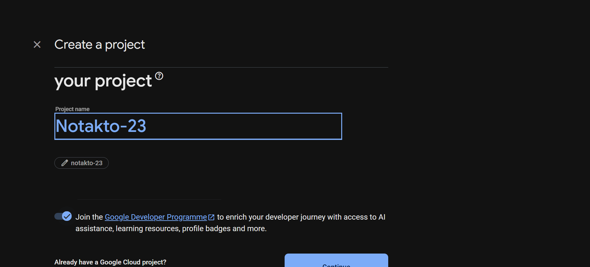
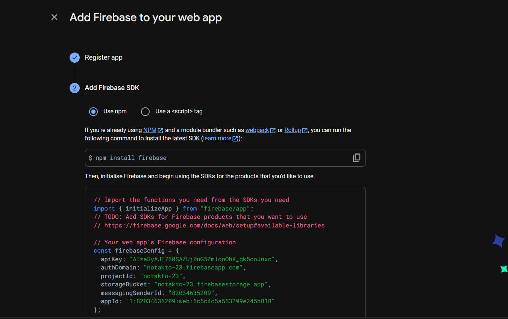
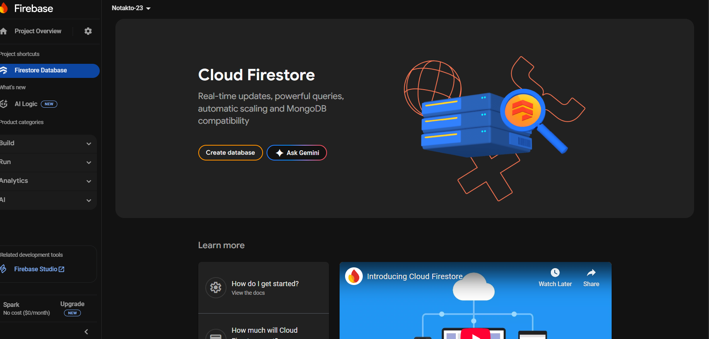
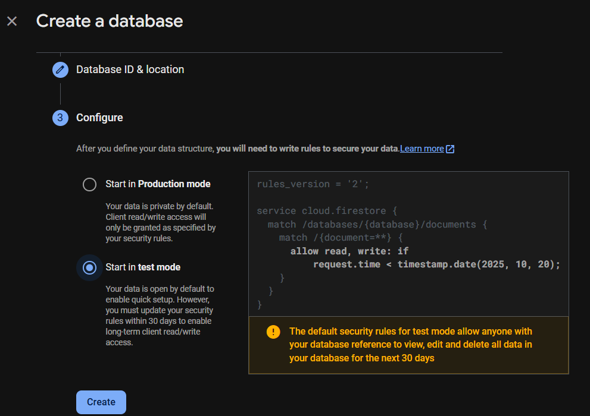
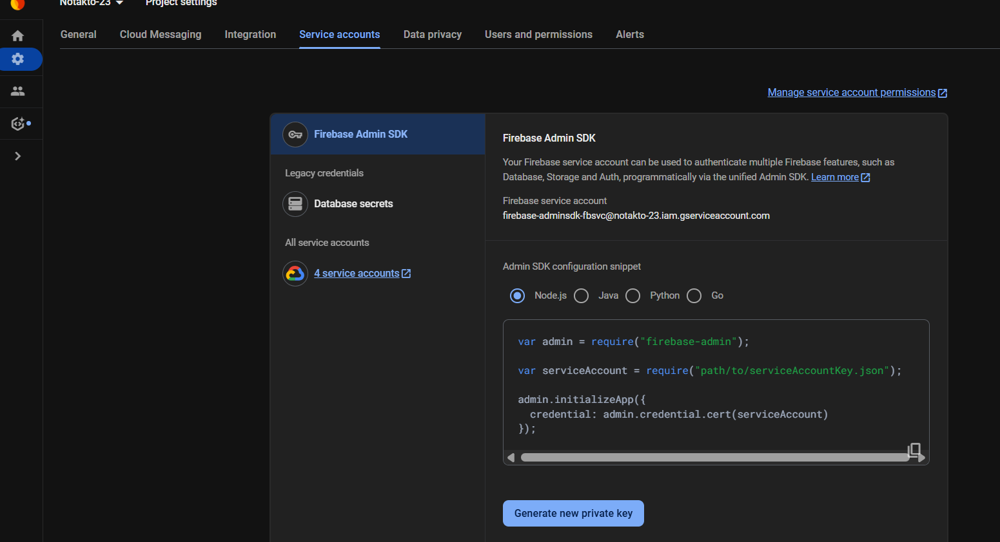

# 🔧 Firebase Setup Guide for Notakto
<!-- 
  This markdown file is meant to be inside docs/firebase-setup.md.
  Contributors can follow this step-by-step guide to set up Firebase Authentication and Firestore locally.
  Screenshots can be added using markdown image syntax: 
-->

This guide helps you configure **Firebase** for local development so that features like Authentication, Firestore work properly.

## 1️⃣ Create a Firebase Project
1. Go to Firebase Console.
2. Click Add Project → Enter a project name,(e.g., Notakto-dev).
3. Firebase defaults to **Standard Edition**, which is fine for this project.
4. (Optional) Disable Google Analytics  → Click **Create Project**. 
5. Wait for project setup to complete.



## 2️⃣ Add a Web App

1. In your project overview, click the Web (</>) icon.
2. Enter a nickname (e.g., Notakto-Web).
3. Click **Register App**.
4. From the Firebase config object that Firebase gives you, note the following keys: 
✅ Keys needed from above for frontend setup:
     projectId     → NEXT_PUBLIC_FIREBASE_PROJECT_ID
     storageBucket → NEXT_PUBLIC_FIREBASE_STORAGE_BUCKET
     apiKey        → FIREBASE_API_KEY

  ## note:
💡 Optional: If your `firebase.ts` initialization requires it, also add:
 NEXT_PUBLIC_FIREBASE_AUTH_DOMAIN=your_project_id.firebaseapp.com

5. Add these to a .env.local file in your project root.
# .env.local
```bash
NEXT_PUBLIC_FIREBASE_PROJECT_ID=your_project_id
NEXT_PUBLIC_FIREBASE_STORAGE_BUCKET=your_project_id.appspot.com
FIREBASE_API_KEY=your_api_key 
```



## 3️⃣ Enable Firestore

1. Go to Firestore Database → **Create Database**.
2. Choose Test Mode.
3. Click **Enable**.



## 4️⃣ Enable Authentication
1. Go to Authentication → Sign-in Methods.
2. Enable Google provider only.
3. Save changes.


## 5️⃣ Configure Environment Variables
Create a file called .env.local in your project root (see .env.example for reference).
You will need keys from the following:

  1️⃣ Firebase Web App (Frontend):
   NEXT_PUBLIC_FIREBASE_PROJECT_ID
   NEXT_PUBLIC_FIREBASE_STORAGE_BUCKET
   FIREBASE_API_KEY

  2️⃣ Firebase Service Account (Backend):
   (Optional) Firebase Admin — Service Account (only if you run server-side/Admin SDK tasks):
   
1. Go to Firebase Console → Project Settings → Service Accounts → Generate Private Key.
2. From the downloaded JSON, map these into `.env.local` (quote as needed):
```bash
FIREBASE_PRIVATE_KEY="YOUR_PRIVATE_KEY"
FIREBASE_CLIENT_EMAIL="YOUR_CLIENT_EMAIL"
FIREBASE_PROJECT_ID="YOUR_PROJECT_ID"
```

3. Coinbase API Key(Testing coins/XP updates):
   Generate from your Coinbase account (for testing coin  updates):
   COINBASE_API_KEY="YOUR_COINBASE_API_KEY"

## Note 
Replace all your_* placeholders with actual values from the Firebase Console.
Only the NEXT_PUBLIC_* keys are required for frontend local development. Service account vars are not needed unless you run Admin SDK code locally.

💡 Note
If you want to test Firestore access or Authentication locally, make sure the same config values are stored in file `firebase.ts` that is in services folder.  
❗ Do **not** commit or push these changes — they are meant for local testing only.


# 6️⃣ Run Locally

```bash
pnpm install:all
pnpm dev:local 
```
1. Open <http://localhost:3000>
2. Sign in with Google.
3. You should see your user appear in Firestore under the users collection.
4. Test in-game coins/XP updates:
    Perform an action that changes coins/XP.
    Check Firestore to ensure the updates are reflected correctly.
           
✅ Tips & Best Practices:
-Keep .env.local secret – never commit it.
-Always test Authentication and Firestore before creating a PR.
-Use Firestore Test Mode only for development, never in production.
