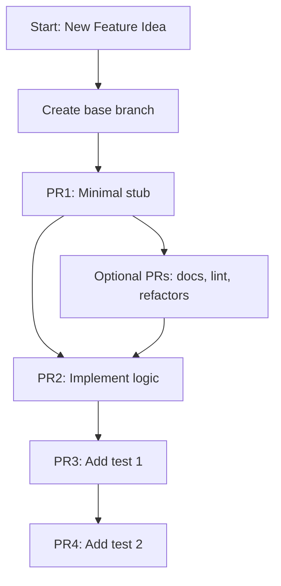

# Short PR Philosophy

Pull Requests (PRs) are easiest to review, test, and merge when they are **short, focused, and consistent**.  
This document explains how to structure PRs so the workflow is smooth for everyone.

---

## Core Principles

### 1. One clear purpose per PR
- A PR should do exactly one thing (e.g., add an endpoint, fix a bug, write one test).
- Avoid mixing unrelated changes.

### 2. Small, but not meaningless
- A PR should be short enough to review quickly.
- Don’t make it too short—changes should still be coherent and consistent.

### 3. Chain PRs when needed
- If a feature requires multiple steps, create a base PR, then build further PRs on top of it.
- Each PR should target its immediate parent branch until the chain is complete.

---

## Example Workflow: Adding a New API Feature

**Goal:** Add a new `/user/info` API that returns details about a user.

- **PR 1 (Base)** → Adds the endpoint and returns `{ status: "ok" }`.  
  _Small, valid, easy to merge._

- **PR 2 (Build on PR 1)** → Implements actual business logic (e.g., returns real user data).  
  _Targets PR 1 branch._

- **PR 3 (Build on PR 1 or 2)** → Adds one unit test (e.g., checks `status: ok`).

- **PR (Another test)** → Adds another unit test (e.g., handles missing user).

---

## Other Examples

### Frontend Change
- PR 1: Add a button with placeholder action.  
- PR 2: Implement the actual click handler.  
- PR 3: Add one test for button rendering.  
- PR 4: Add one test for button action.  

### Refactor
- PR 1: Move code into a helper function.  
- PR 2: Replace usage in one module.  
- PR 3: Replace usage in another module.  

### Bugfix
- PR 1: Add a failing test that reproduces the bug.  
- PR 2: Fix the bug.  
- PR 3: Add an extra edge-case test.  

---

## Do’s and Don’ts

### ✅ Do’s
- Keep PRs focused on one task.  
- Make PRs short enough to be reviewed in minutes.  
- Chain related PRs instead of cramming everything into one.  
- Write meaningful commit messages and PR descriptions.  

### ❌ Don’ts
- Don’t mix multiple features, fixes, or refactors in a single PR.  
- Don’t open PRs so small they break context (e.g., only adding an empty file).  
- Don’t leave out tests entirely if they are relevant.  
- Don’t create massive PRs that take hours to review.  

## Visual Flow (Mermaid)

---
## Why This Helps

- **Faster reviews** → Maintainers can merge small chunks quickly.  
- **Easier iteration** → Contributors can improve step by step.  
- **Less risk** → Small PRs are less likely to break the project.  
- **More contributions** → Especially for programs like GSSOC, contributors earn points for multiple merged PRs.  

---

## Quick Checklist Before Submitting a PR

- Does this PR have **one clear purpose**? ✅  
- Is it **short, but meaningful**? ✅  
- Could the work be **split into a chain of PRs**? ✅  

---

✨ **Keep PRs short, focused, and consistent. It helps everyone work better together!**
